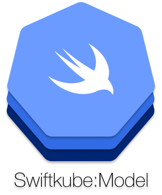

<p align="center">
	
</p>

<p align="center">
	
	<a href="https://v1-18.docs.kubernetes.io/docs/reference/generated/kubernetes-api/v1.18/">
		
	</a>
	<a href="https://swift.org/package-manager">
		
	</a>
	
	<a href="https://github.com/swiftkube/model/actions">
		
	</a>
</p>

## Table of contents

* [Overview](#overview)
* [Compatibility Matrix](#compatibility-matrix)
* [Usage](#usage)
	* [Examples](#examples)
	* [Builders](#builders)
	* [Extensions](#extensions)
	* [Type-erasure](#type-erasure)
* [Installation](#installation)
* [License](#license)

## Overview

`SwiftkubeModel` is a zero-dependency Swift package for Kuberente API objects.

- [x] Model structs for all Kuberentes objects
- [x] `Codable` support
- [x] Closure-based builders for convenient object composition
- [x] Type-erased wrappers for Kubernetes resources

## Compatibility Matrix

|                           | <1.18.9 | 1.18.9 - 1.18.13 | 1.19.8 |
|---------------------------|---------|------------------|--------|
| SwiftkubeModel 0.2.x      | -       | ✓                |-       |
| SwiftkubeModel 0.3.x      | -       | -                |✓       |

- `✓` Exact match of API objects in both model and the Kubernetes version.
- `-` API objects mismatches either due to the removal of old API or the addition of new API. However, everything the model and Kubernetes have in common will work.

## Usage

To use the Kubernetes objects just import `SwiftkubeModel`: 

```swift
import SwiftkubeModel

let metadata = meta.v1.ObjectMatadata(name: "swiftkube")
let pod = core.v1.Pod(metadata: metadata)
```

All the objects are namespaced according to their API group and version, e.g. `apps.v1.Deployment` or `networking.v1beta1.Ingress`. Which means, that for example `rbac.v1.Role` and `rbac.v1beta1.Role` are completely different objects.

### Examples

Any Kubernetes object can be constructed directly using the model structs. Here is an example for a `Deployment` manifest:

```swift
let deployment = apps.v1.Deployment(
    metadata: meta.v1.ObjectMeta(
        name: "nginx"
    ),
    spec: apps.v1.DeploymentSpec(
        replicas: 1,
        selector: meta.v1.LabelSelector(
            matchLabels: ["app": "nginx"]
        ),
        template: core.v1.PodTemplateSpec (
            spec: core.v1.PodSpec(
                containers: [
                    core.v1.Container(
                        image: "nginx",
                        name: "nginx",
                    )
                ]
            )
        )
    )
)
```

Here is a `ConfigMap`:

```swift
let configMap = core.v1.ConfigMap(
    metadata: meta.v1.ObjectMeta(
        name: "config"
    ),
    data: [
        "env": "dev",
        "log_leve": "debug"
    ]
)
```

A more complete example of a `Deployment`, that defines `Probes`, `ResourceRequirements`, `Volumes` and `VolumeMounts` would look something like this:

```swift
let deployment = apps.v1.Deployment(
    metadata: meta.v1.ObjectMeta(
        name: "opa",
        namespace: "default"
    ),
    spec: apps.v1.DeploymentSpec(
        replicas: 2,
        selector: meta.v1.LabelSelector(
            matchLabels: ["app": "opa"]
        ),
        template: core.v1.PodTemplateSpec (
            spec: core.v1.PodSpec(
                containers: [
                    core.v1.Container(
                        image: "openpolicyagent/opa",
                        name: "opa",
                        readinessProbe: core.v1.Probe(
                            failureThreshold: 1,
                            httpGet: core.v1.HTTPGetAction(
                                path: "/health",
                                port: 8080
                            ),
                            initialDelaySeconds: 10,
                            periodSeconds: 20,
                            successThreshold: 2,
                            timeoutSeconds: 5
                        ),
                        resources: core.v1.ResourceRequirements(
                            limits: [
                                "ram": "512MB"
                            ],
                            requests: [
                                "ram": "128MB",
                                "cpu": "200m",
                            ]
                        ),
                        volumeMounts: [
                            core.v1.VolumeMount(
                                mountPath: "/etc/test",
                                name: "data"
                            )
                        ]
                    )
                ],
                imagePullSecrets: [
                    core.v1.LocalObjectReference(name: "secret-name")
                ],
                volumes: [
                    core.v1.Volume(
                        name: "data",
                        persistentVolumeClaim: core.v1.PersistentVolumeClaimVolumeSource(
                            claimName: "pvc",
                            readOnly: true
                        )
                    )
                ]
            )
        )
    )
)
```

### Builders

From the above example it is clear, that a certain knowledge of all the subtypes and their API groups is required, in order to comose a complete manifest. Furthermore, Swift doesn't allow arbitrary arguments order.

For this purpose `SwiftkubeModel` provides simple closure-based builder functions for convenience. All these functions reside under the `sk` namespace.

> :warning: The syntax is not yet finalized and can break many times before v1.0.0 ships. This can also be replaced with Function/Result Builders, which is currently a WIP.


> :warning: `SwiftkubeModel` currently provides conveniece builders only for the most common Kubernetes objects.

The above example would look like this:

```swift
let deployment = sk.deployment(name: "opa") {
    $0.metadata = sk.metadata {
        $0.namespace = "default"
    }
    $0.spec = sk.deploymentSpec {
        $0.replicas = 1
        $0.selector = sk.match(labels: ["app": "nginx"])
        $0.template = sk.podTemplate {
            $0.spec = sk.podSpec {
                $0.containers = [
                    sk.container(name: "opa") {
                        $0.image = "openpolicyagent/opa"
                        $0.readinessProbe = sk.probe(action: .httpGet(path: "/health", port: 8080)) {
                            $0.failureThreshold = 1
                            $0.initialDelaySeconds = 10
                            $0.periodSeconds = 20
                            $0.successThreshold = 2
                            $0.failureThreshold = 5
                        }
                        $0.resources = sk.requirements {
                            $0.requests = [
                                "ram": "512MB"
                            ]
                            $0.limits = [
                                "ram": "128MB",
                                "cpu": "200m",
                            ]
                        }
                        $0.volumeMounts = [
                            sk.volumeMount(name: "data", mountPath: "/etc/test")
                        ]
                    }
                ]
                $0.imagePullSecrets = [
                    sk.localObjectReference(name: "secret-name")
                ]
                $0.volumes = [
                    sk.volume(name: "data", from: .persistentVolumeClaim(claimName: "pvc", readOnly: true))
                ]
            }
        }
    }
}
```

### Extensions

In addition to closure-based builders, `SwiftkubeModel` extends the Model objects with some convenience functions, *inspired by [cdk8s](https://cdk8s.io)*

#### core.v1.ConfigMap

- Populating a `ConfigMap`

```swift
let configMap: core.v1.ConfigMap = sk.configMap(name: "test")

// populate the config map
configMap.add(data: "stuff", forKey: "foo")
configMap.add(binaryData: <binary>, forKey: "foo")
configMap.add(file: URL(fileURLWithPath: "/some/path"), forKey: "foo")
configMap.add(binaryFile: URL(fileURLWithPath: "/some/path"), forKey: "foo")
```

### core.v1.Container

- Mount a volume in a container

```swift
let container: core.v1.Container = ...
let volume: core.v1.Volume = ...

// mount a volume in a container
container.mount(volume: volume, on: "/data")
container.mount(volume: "dataVolume", on: "/data")
```

### core.v1.Namespace

- Finalizers


```swift
let namespace: core.v1.Namespace = ...

// add/remove finalizers
namespace.add(finalizer: "foo")
namespace.remove(finalizer: "foo")
```

#### core.v1.Secret

- Populating a `Secret`: the values are Base64-encoded automatically

```swift
let secret: core.v1.Secret = sk.secret(name: "test")

// populate the secert
configMap.add(data: "stuff", forKey: "foo")
configMap.add(file: URL(fileURLWithPath: "/some/path"), forKey: "foo")
```

#### core.v1.Service

- Server ports on a service

```swift
let service: core.v1.Service = ...

// add a service port entry
service.serve(port: 8080, targetPort: 80)
```

#### core.v1.ServiceAccount

- Use secrets


```swift
let serviceAccount: core.v1.ServiceAccount = ...

// add an object reference for a secret
serviceAccount.use(imagePullSecret: "pullSecret")
serviceAccount.use(secret: "secret", namespace: "ns")
```

#### apps.v1.Deployment

- Exposing a `Deployment`

```swift
let deployment: apps.v1.Deployment = ...

// expose a deployment instance to create a service
let service = deployment.expose(on: 8080, type: .clusterIP)
```

### Type-erasure

Often when working with Kubernetes the concrete type of the resource is not known or not relevant, e.g. when creating resources from a YAML manifest file. Other times the type or kind of the resource must be derived at runtime given its string representation.

`SwiftkubeModel` provides a type-erased resource implementation `AnyKubernetesAPIResource` and its corresponding List-Type `AnyKubernetesAPIResourceList` in order to tackle these use-cases.

Here are some examples to clarify their purpose:

```swift
// Given a JSON string, e.g. at runtime, containing some Kuberenete resource
let str = """
   {
      "apiVersion": "v1",
      "kind": "Pod",
        "metadata": {
          "name": "test",
          "namespace": "ns"
      }
   }
	"""

// We can still decode it without knowing the concrete type
let data = str.data(using: .utf8)!
let resource = try? JSONDecoder().decode(AnyKubernetesAPIResource.self, from: data)

// When encoding the previous instance, it serializes the underlying resource
let data = try? JSONEncoder().encode(resource) 
```

## Installation

To use the `SwiftkubeModel` in a SwiftPM project, add the following line to the dependencies in your `Package.swift` file:

```swift
.package(name: "SwiftkubeModel", url: "https://github.com/swiftkube/model.git", from: "0.3.0"),
```

then include it as a dependency in your target:

```swift
import PackageDescription

let package = Package(
    // ...
    dependencies: [
        .package(name: "SwiftkubeModel", url: "https://github.com/swiftkube/model.git", from: "0.2.0")
    ],
    targets: [
        .target(name: "<your-target>", dependencies: [
            .product(name: "SwiftkubeModel", package: "SwiftkubeModel"),
        ])
    ]
)
```

Then run `swift build`.

## License

Swiftkube project is licensed under version 2.0 of the [Apache License](https://www.apache.org/licenses/LICENSE-2.0). See [LICENSE](./LICENSE) for more details.
